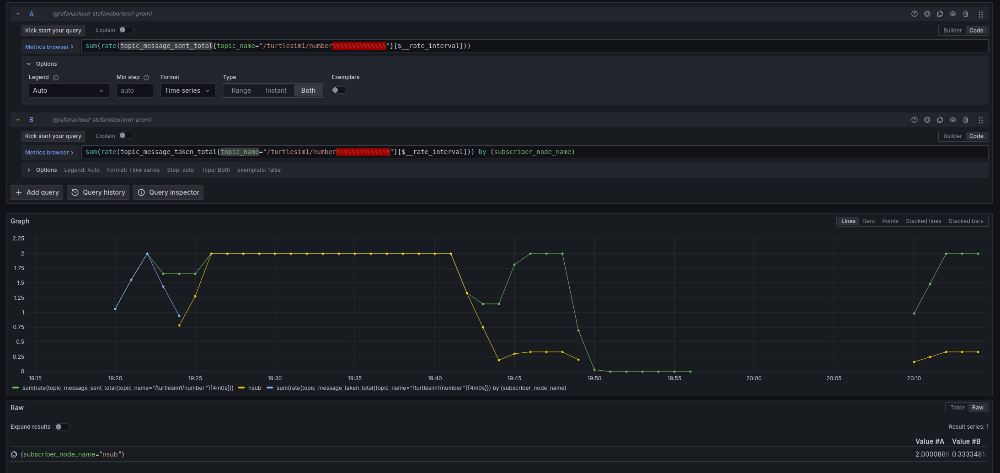

# eBPF ROS - telemetry instrumentation for ROS2 applications

This work aims at providing an eBPF based telemetry instrumentation leveraging eBPF and exporting telemetry in the OpenTelemetry standard.

## Project status

This project is highly experimental, breaking changes are expected to happen. It works on my machine, but the code in this repository has not been tested on other machines (in fact the architecture to compile the project is hardcoded).
On top of that, it's my first time fumbling with eBPF and Golang, any constructive feedback on how to improve the code is more than welcome!

### Exposed metric

| Name    | Description | Type | Dimensions |
| -------- | ------- | ------- | ------- |
| topic_message_sent  | The number of message published on the topic by each publisher | Counter  | topic_name, publisher_node_name, publisher_node_namespace
| topic_message_taken  | The number of message taken on the topic by each subscriber | Counter  | topic_name, subscriber_node_name, subscriber_node_namespace
| node_create  | Number of nodes created  | Counter    | None

## Building and running the project

Run 'make clean' to clean up already compiled artefacts
Run 'make' to compile the ebpf programs and build the go userspace program
Run 'sudo -E ./ebpf-ros' to launch the program. Superuser permissions are needed to load the program in the kernel, and the -E flag is used to preserve the user space environment variables used for the OTeL exporter. This is suboptimal and should be changed if possible

# TODO
- [] Figure out why performance event go struct is not generated by ebpf2go
- [] Figure out why the data_t struct is not generated by ebpf2go

# Acknowledgements

I wanted to acknowledge [Trace-enabled Timing Model Synthesis for ROS2-based Autonomous Applications](https://www.researchgate.net/publication/375838485_Trace-enabled_Timing_Model_Synthesis_for_ROS2-based_Autonomous_Applications) publication for the idea and pointer to instrumentation trace points.
